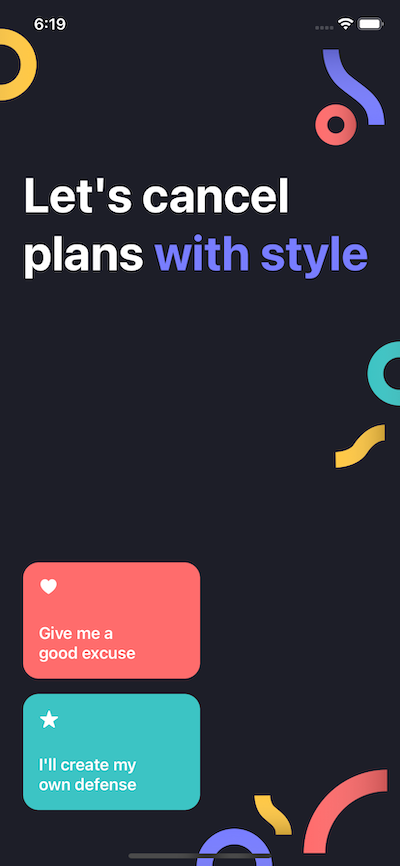
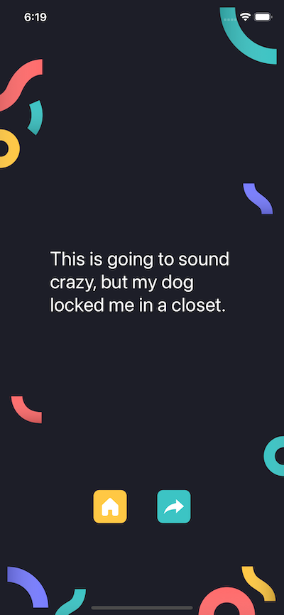

# ExcuseGenerator

This is an application to get cool excuses to avoid going to these events nobody want :)

## Architecture

We use MVVM-C with combine.

## Install

To be able to run this project you need to follow some steps.

### Mint

We use mint for SwiftLint and R.swift because at the moment of making the project, we encountered some problems when trying to use them with SPM.

1. `brew install mint`
2. The file Mintfile contains the dependencies we use
3. Before running the project, please run the following: `mint bootstrap`
4. You can verify that SwiftLint and R.swift were install successfuly by running: `mint list`
5. Now you can run on simulator :)

### Running in devices

We use Fastlane Match for managing the certificates and provisioning profiles. In order to get these you can follow the next steps:

1. Install bundler in your machine following their steps: https://bundler.io
2. Once bundler is installed, you can go to the root of the project where there should be a Gemfile with the fastlane version the whole team is using.
3. Run `bundle install`
4. Run `bundle exec fastlane get_signing_assets`. This will get the current files from the match repository.
5. Restart xcode

### Add new devices

**Coming soon**. In this projectwe didn't use devel/staging environment so there wasn't a need to make this lane. Will work on this for future projects.

## Deploys

We use Fastlane for deploying to AppStore connect. In order to make a release follow the next steps:

1. Increment the version if needed
2. Run `bundle exec fastlane deploy_appstore`. This will increment a build number (we did like this because there is no devel/staging environment)
3. Enjoy the new app :)